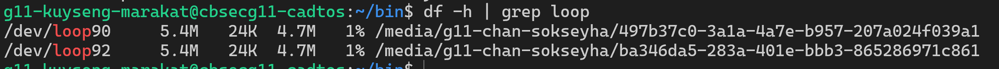
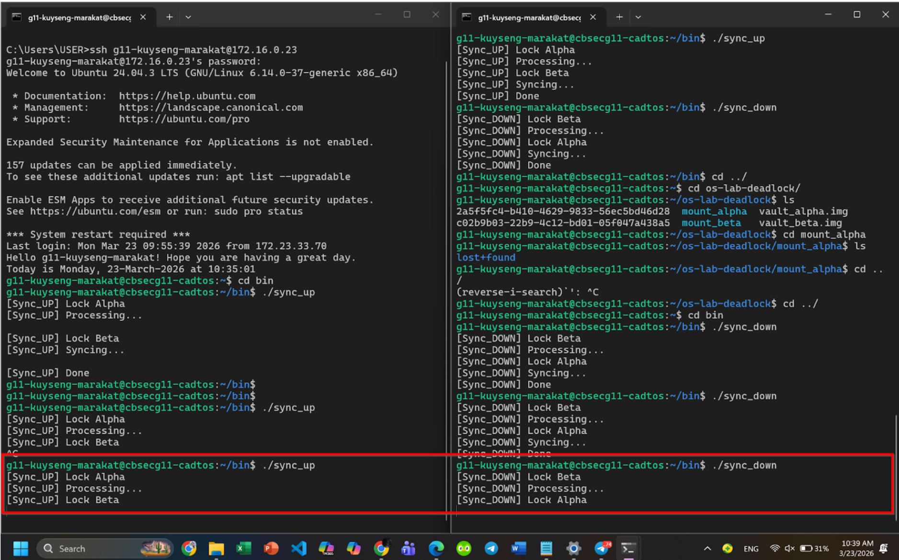
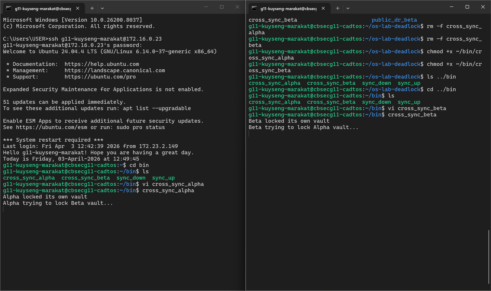
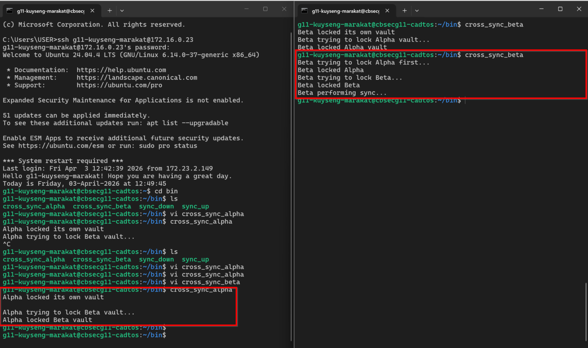
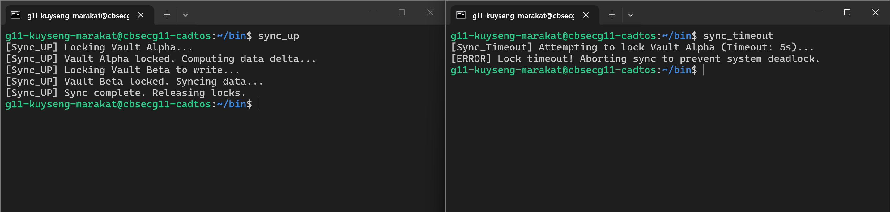
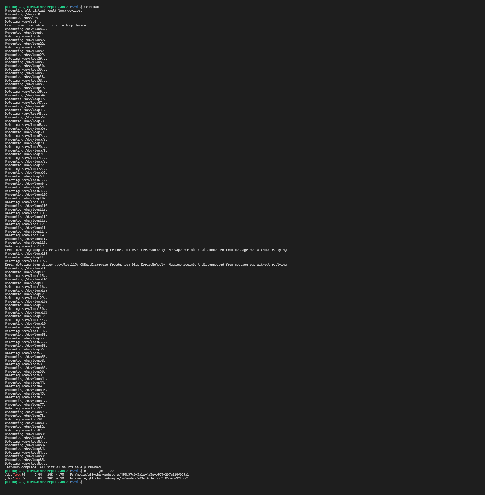

# Operating Systems & Security Lab: The Quantum Vault Deadlock

**Duration:** 3 Hours  
**Topic:** File System Mounting, Process Synchronization, and Deadlocks

---

## Scripts Location

All executable scripts are saved in the `~/bin` folder on the CentOS server. They are **not included** in this repository.  

- `sync_up`  
- `sync_down`  
- `cross_sync_alpha` / `cross_sync_beta`  
- `sync_timeout`  
- `teardown`

---

## Lab Overview

This lab demonstrates the creation and management of virtual drives, triggering deadlocks, and applying safe synchronization strategies to prevent or recover from deadlocks in a multi-user Linux environment.  

---

## Level 1: Virtual Vault Provisioning

Created two virtual drives (`vault_alpha.img` and `vault_beta.img`), formatted as ext4, mounted as loop devices, and created symlinks for easier access.

**Screenshot: Loopback devices mounted**

**Explanation:**  
The `df -h | grep loop` output shows the two loopback devices mounted, confirming the virtual drives are correctly attached and accessible.

---

## Level 3: Local Circular Wait (Deadlock)

Triggered a local deadlock by running `sync_up` and `sync_down` simultaneously. Both scripts waited indefinitely on each other’s locks.

**Screenshot: Frozen terminals**

**Explanation:**  
`sync_up` held the Alpha lock while waiting for Beta, and `sync_down` held the Beta lock while waiting for Alpha. This caused a classic circular wait.

---

## Level 4: Site-to-Site Sync (Multiplayer Deadlock)

Simulated a distributed deadlock between two users on the same server using cross-site synchronization scripts.

**Screenshot: Multiplayer deadlock**

**Explanation:**  
Both users froze while trying to lock each other’s vaults, demonstrating a cross-user deadlock scenario.

---

## Level 5: Global Resource Ordering (The Patch)

Implemented a strict global order: Alpha’s lock must always be acquired before Beta’s lock to prevent circular waits.

**Screenshot: Deadlock prevented with global ordering**

**Explanation:**  
Terminals show sequential execution. Player A acquires Alpha first, then Beta. Player B waits for Alpha, ensuring no deadlock occurs.

---

## Level 6: Deadlock Recovery (Timeout Patch)

Tested timeout strategy with `sync_timeout` using `flock -w 5`. If a lock is unavailable for 5 seconds, the script aborts safely.

**Screenshot: Timeout handling**

**Explanation:**  
Terminal shows that `sync_timeout` waited 5 seconds for Alpha lock, failed gracefully, and prevented freezing.

---

## Level 7: Safe Ejection (Teardown)

Unmounted the virtual drives and detached loopback devices safely using the `teardown` script.

**Screenshot: Clean df -h output after teardown**

**Explanation:**  
The loopback devices are no longer mounted. Proper teardown prevents file system corruption and frees kernel resources.

---

**Lab Completed By:** g11-kuyseng-marakat  
**Date:** 03/April/2026

